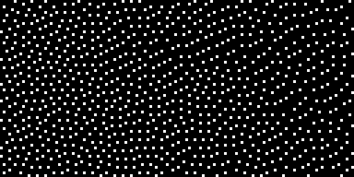

# dither

The [Floyd-Steinberg dithering algorithm](https://en.wikipedia.org/wiki/Floyd%E2%80%93Steinberg_dithering) is a well-known method for reducing an image into a reduced set of colors while attempting to minimize perceptual changes.

Dithering is particulary useful when converting to a bitonal image that only has two colors (like black and white).  For example, if we take this original full-color image:

and convert it to black and white based on a threshold luminosity of 50%, we get this result, which loses much of the original detail:

But using Floyd-Steinberg dithering, we can preserve more information about the brightness of the original image.  This example is magnified 400%, so it looks very pixelated, but if you squint your eyes, or look at it from a distance, it's not too bad.

# How does it work?

The Floyd-Steinberg algorithm is relatively simple.  It scans the image on pixel at a time, scanning the top line left to right, then the next line, etc. until it reaches the bottom.  For a bitonal dither, we first convert the whole image to grayscale, where each pixel is has a luminosity (brightness) value of 0 to 255.

The algorithm then looks at the value of each pixel.  Values 0-127 (<50%) become 0 (black) and values 128-255 (>50%) become 255 (white).  So a value of 16 would become 0.  The "error" is calculated to be thedifference between the old and new values, which would be 16.  This error is then distributed across the neighboring pixels that have not yet been scanned, as follows:

| x | x | x |
|-|-|-|
| **x** | @ | 7 |
| 3 | 5 | 1 |

As the scan progresses, in a region of dark (but not black) pixels, this error will eventually accumulate enough to have an occasional white pixel.  Part of the beauty of the result is the way these occasional points are spaced out, sometimes appearing random and sometimes with a discernable pattern.

# Variations

I was curious why or how the weighting matrix above was calculated.  Floyd-Steinberg is very fast to compute because it only needs to scan once through each pixel.  That is why the error is not distributed to any of the pixels above or to the left in the current row.  But why the 7, 3, 5, 1 values?  I haven't seen any explanation of why these specific values were chosen, besides the fact that they add up to 16 (so actually we are adding 7/16 of the error to the pixel to the right).

I wanted to experiment with other variations of weights.  Maybe other values would result in unpleasant or rigid patterns of dots, and the 7, 3, 5, 1 was the only way to have a balanced output?

TODO: add images of variants

TODO: add animation of a range of values leading to complete degradation

[Try the online demo](https://kgjenkins.github.io/dither/)
